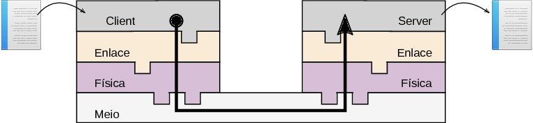
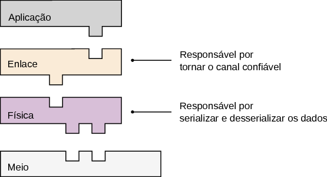
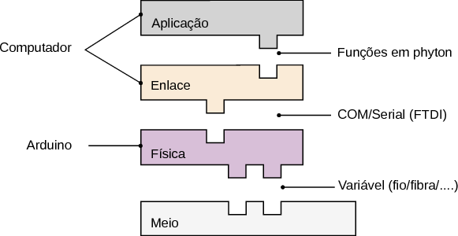
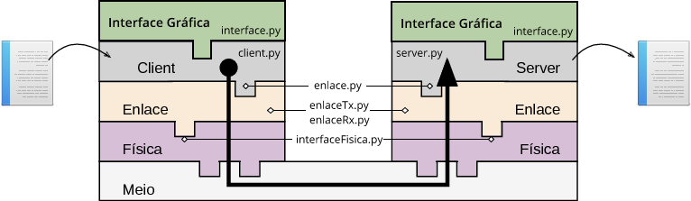
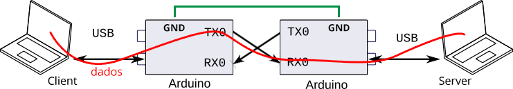

# Camada Física - Projeto 1 - COM-Client-Server
Leonardo Medeiros e Martim Ferrera José

Essa primeira etapa do projeto consiste na modificação da comunicação em modo loopback para uma comunicação ponto a ponto entre dois computadores via a interface UART. Como ilustrado no diagrama a seguir:

O exemplo localizado nessa pasta cria as seguintes camadas de abstração da comunicação:

Nesse protocolo, temos três camadas: Aplicação, enlace e física. As camadas são implementadas nos seguintes meios:

# Código base

O código possui os seguintes arquivos : interface.py; server.py; server.py; enlace.py; enlaceTx.py; enlaceRx.py; interfaceFisica.py. Sendo cada um responsável por :

- interface.py : Carrega uma interface gráfica, em que é possível escolher qual "papel" você quer que seu computador execute, server ou client. Caso escolha Client, abre-se uma janela de procura de arquivo, em que é possível escolher a imagem a ser transmitida via enlace. Caso seja Server, o computador se prepara para receber a imagem e a salva em imgs/recebida.png

- server.py : Código que prepara o computador para receber a imagem do Client

- client.py : Código que carrega a imagem por meio da interface gráfica e a transmite para o Server.

- enlace.py : Interface de comunicação entre a aplicação e o enlace.

- enlaceTx.py : parte do enlace responsável por transmitir n dados via a camada física (interfaceFisica.py)

- enlaceRx.py : parte do enlace responsável por receber n dados via a camada física (interfaceFisica.py)

- interfaceFisica.py : Código que lida com o envio dos dados para o Arduino e recebimento.

A figura a seguir faz uma relação dos códigos com cada etapa da comunicação a ser desenvolvida :

Com a seguinte árvore de dependência :

## Threads 

Para haver transmissão e recepção simultâneamente o código faz uso de threads, uma para enlaceTx e outra para o enlaceRX possibilitando que a interface enlace transmita e receba dados de forma contínua.

# Modo de comunicação - Client-Server

No nosso projeto, utilizamos o Arduino como placa de rede, e o protocolo UART como forma de comunicação entre dois nós. Nesse caso conecta-se a saída da porta UART (TX0) a entrada da porta UART (RX0), assim todo dado que for transmitido pelo computador, será encaminhado para a porta TX0 e recebida pela porta RX0 e então devolvido ao computador pelo USB. Na ilustração é possível observar que ambos os computadores podem executar o "papel" de Client ou Servidor, basta selecionar pela interface gráfica.

Obs: É preciso utilizar um ground em comum, pois o protocolo UART é composto de sinais *low-level* e *high-level*, então para o receptor (Server) entender o protocolo, ele deve ter a referência de voltagem do *low-level*.

## Descrição do funcionamento:
Ao carregar uma imagem pelo Client, são feitas tentativas de conexão ao Server, para verificar se a conexão é confiável. Quando a conexão é estabelecida, o *enlaceTx.py* transmite os dados via a camada física (interface.py), que serializando-os e os enviando de um arduino a outro por meio de jumpers, que conectam os pinos de saída (TX0) a porta de entrada (RX0). Ao chegar no arduino receptop (Server), os dados são desserializados pela camada física do server e recebidos pelo enlace, salvando os dados no computador.
