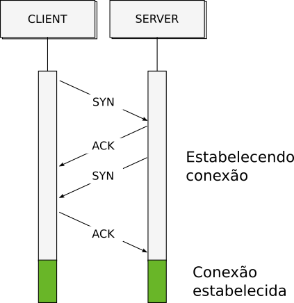
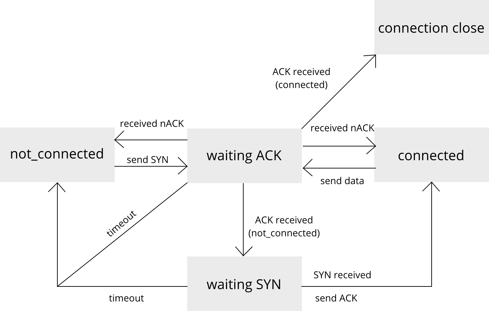
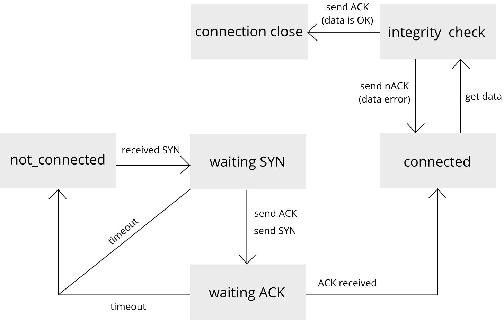

# Camada Física - Projeto 1 - COM-Handshake
Leonardo Medeiros e Martim Ferrera José

Nessa etapa do projeto, foi implementado de forma incremental um protocolo de handshake na camada de enlace que garante ao *client* que dados só serão trafegados na rede quando o *server* estiver habilitado para receber. Além disso, um protocolo de reconhecimento (ACK e NACK) foi implementado para que o *client* tenha conhecimento do status da recepção do pacote pelo *server*, caso uma falha for detectada, ele reenvia o pacote.

## Funcionamento do Handshake
O handshake foi implementado na camada *enlace* por meio de duas funções, a *connect()* para o **Client** e *bind()* para o **Server**, que funcionam como uma Máquina de estados, que avaliam os dados que estão recebendo, por meio de funcões como *getCommandType()* e *getPacketType()*.

### Handshake
Para estabelecer uma conexão segura com o *Server*, o *Client* envia um pacote comando SYN para o *Server*, que deve responder durante um tempo hábil se ele recebeu este "pedido" de Sincronização. Caso ele receba, ele deve responder (enviar) com um pacote comando ACK, monstrando reconhecimento positivo do SYN e logo depois deve enviar um SYN para firmar a conexão por sua parte. O Client ao receber este ACK + SYN, deve responder ACK para confirmar a conexão por sua parte também. Com a conexão estabelecida de forma segura, o *Client* pode enviar os pacotes de dados. Caso uma das partes responde com nAck, o handshake se reinicia. O funcionamento do handshake é ilustrado no diagrama a seguir:

### Pacotes de Comando
Os pacotes de comandos foram implementados da seguinte forma:
- Head: headStart (16 bits), size (16 bits), typeCommand (8 bits)
- Payload: **Não contém payload** -> Head size = 0
- EOP: 4 constantes (8 bits, 8 bits, 8 bits, 8 bits)

Os tipos de pacotes de comandos foram decididos da seguinte forma:
- SYN: Pacote de sincronismo (0x10)
- ACK: Pacote de reconhecimento positivo (0x11)
- nACK: Pacote de reconhecimento negativo (0x12)

Por exemplo, o pacote **nACK** ficaria da seguinte maneira:

| Head | Payload | EOP |
| ------------- | ------------- | ------------- |
|  `\x00\xff\x00\x00\x12` |  | `\x01\x02\x03\x04` |

### Pacotes de Dado
Para diferenciar os pacotes de dados dos de comando, declaramos no Head todos os pacotes o *typeCommand*. Caso ele seja 0x00, o código entende que este pacote é um pacote de dados.

Por exemplo, o pacote carregando uma imagem .png ficaria da seguinte maneira:

| Head | Payload | EOP |
| ------------- | ------------- | ------------- |
| `\x00\xff\x54\x45\x00` | ... `\xfd\x37\x67\x9f` ... | `\x01\x02\x03\x04` |

obs: Size e payload fictício, somente para ilustração.

### Máquinas de Estado
Como dito anteriormente, as máquinas de estado avaliam o **estado** da comunicação entre Client e Server e tomam ações a partir desse estado. Os estados dependem de tempo e inputs/outputs dado pelos pacotes comando recebidos e/ou enviados. As máquinas de estados de ambos *Server* e *Client* estão representadas nos diagramas abaixo:

#### Máquina de Estados do Client
 { width=30% }

#### Máquina de Estados do Server
 { width=30% }

O tempo do timeout utilizado pelas máquinas de estados foi de 0.15 ms, porque o envio e o recebimento do pacote pela camada física não é instantâneo. Também usufruimos do tempo que leva para o código rodar (prints demoraram um tempo considerável).

## Reconhecimento do pacote
Para verificar a integridade dos pacotes, o Server realiza uma chegagem do tamanho payload recebido com o tamanho do payload declarado no Head. Se esse valor for diferente, o Server responde o recebimento do pacote de dados com um nACK, caso contrário, ele responde com um ACK, sinalizando que recebeu o pacote de forma íntegra e salva os dados. Quando o Client recebe um nACK do Server, ele reenvia o pacote anteriormente corrompido e espera um ACK para considerar o envio como positivo.